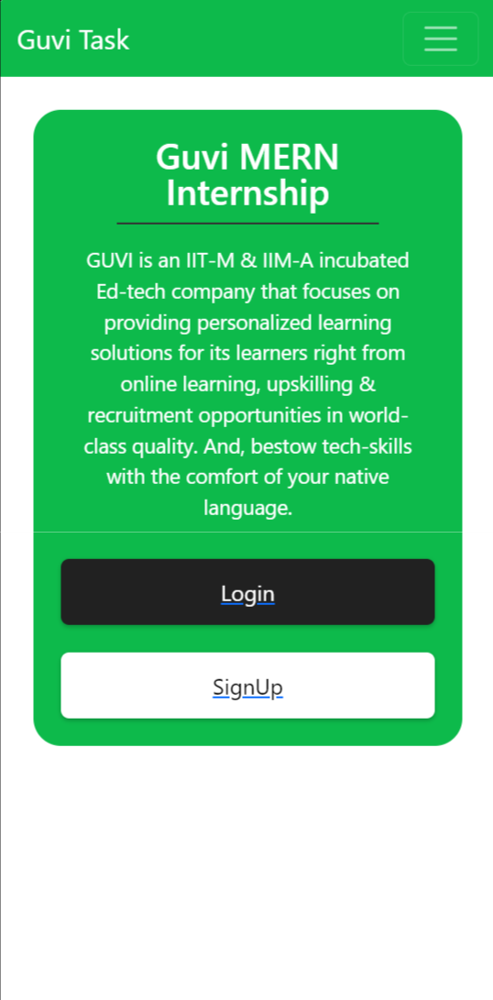
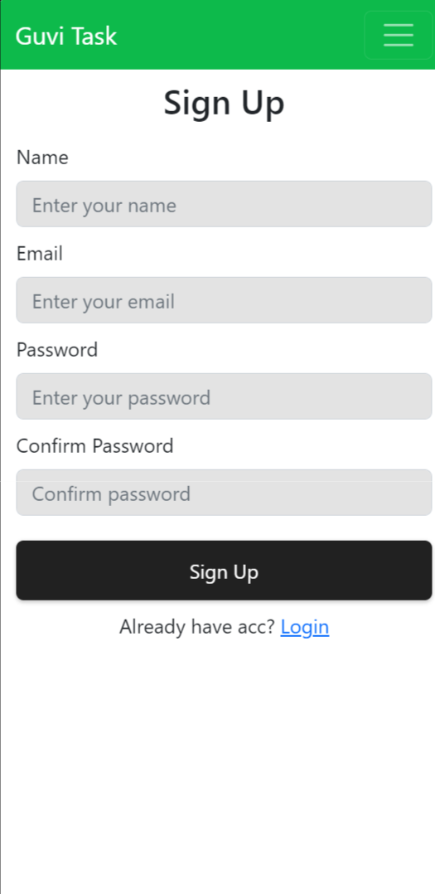
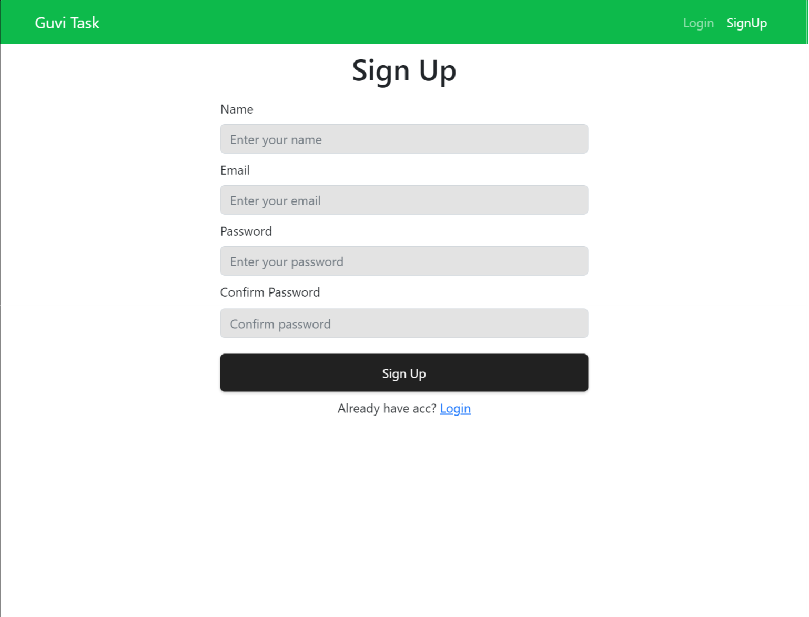
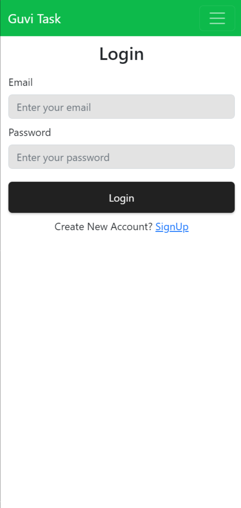
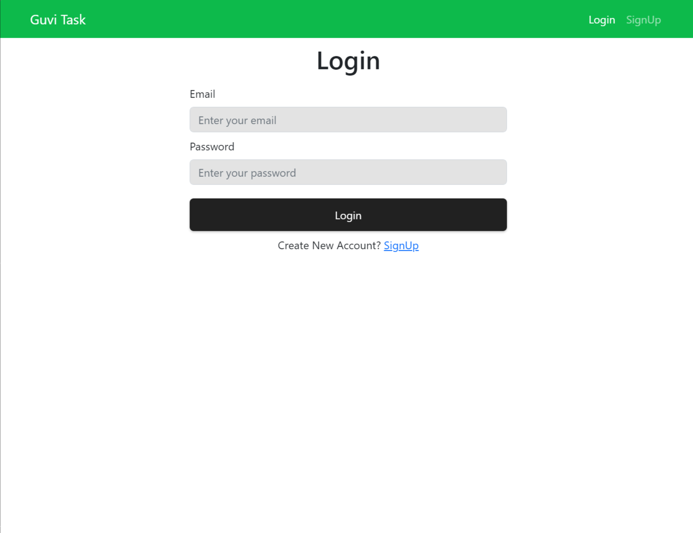
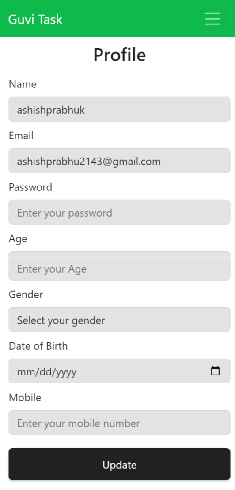
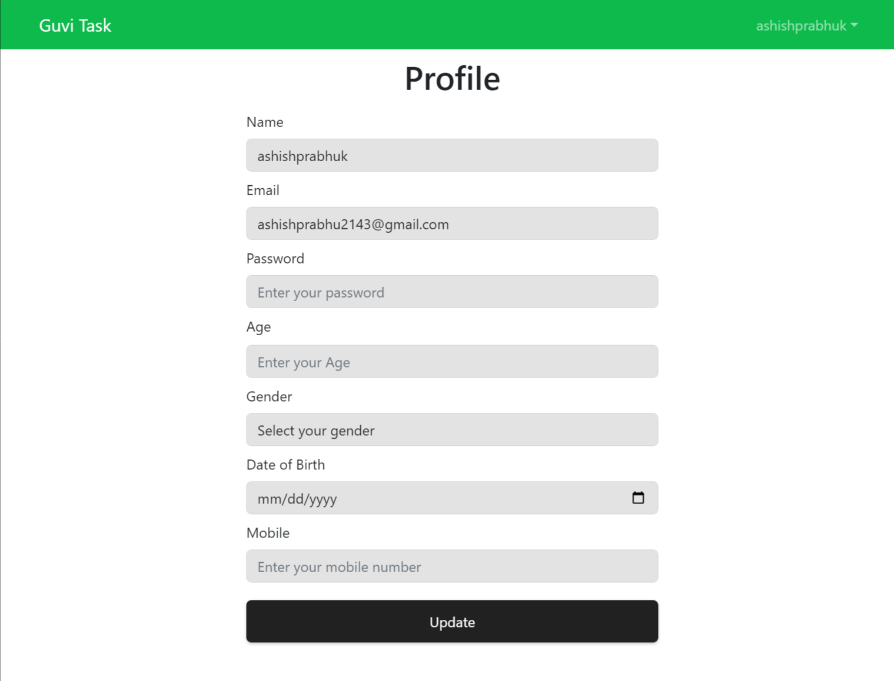
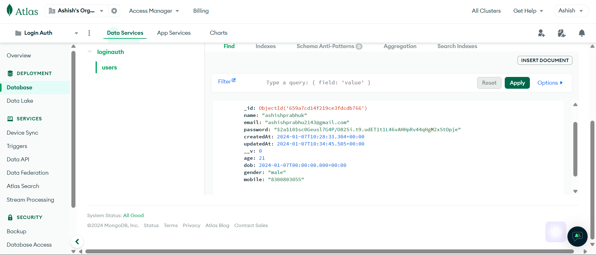

# Guvi Tech Support Mern Stack role

- Github Repo : [https://github.com/ashishprabhuk/Guvi-Intern-Task](https://github.com/ashishprabhuk/Guvi-Intern-Task)

- Frontend Link : [https://guvi-intern-backend.netlify.app/](https://guvi-intern-backend.netlify.app/)

- Backend Link : [https://guvi-intern-backend.netlify.app/](https://guvi-intern-backend.netlify.app/)











### Example of User Data in MongoDB:


## Problem Statement:

- Created a signup page where a user can register with following details(Name,
email, password, confirm password).
- A login page to log in with the details(email & password).
- After successful login it will redirect to a profile page which
contains additional details such as age,gender,dob,mobile, etc which can be
updated by the user.
- Once the user logs out it will be redirect to the login page.


### Install Dependencies 
- Backend:
```
npm install
```
- Frontend:
```
cd frontend
npm install
```

### Run in your System

```
# Run frontend  & backend in the parent directory using Nodemon
npm run dev

# Run backend directory only
npm run server
```

