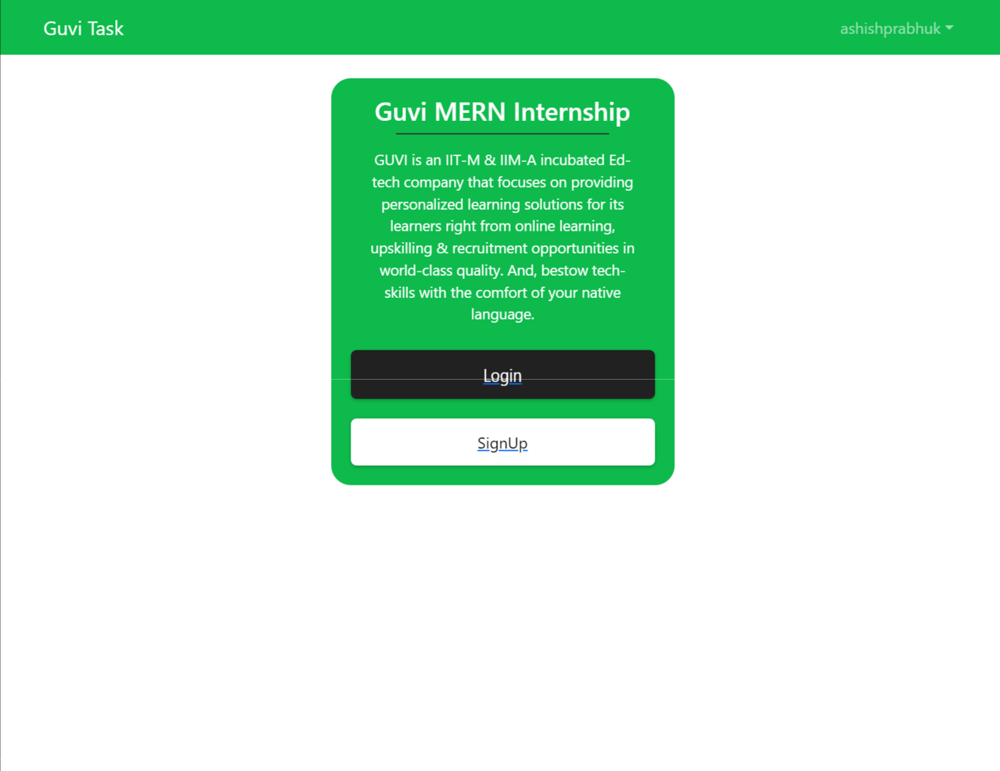

# Guvi Tech Support Mern Stack role





## Problem Statement:

- Created a signup page where a user can register with following details(Name,
email, password, confirm password).
- A login page to log in with the details(email & password).
- After successful login it will redirect to a profile page which
contains additional details such as age,gender,dob,mobile, etc which can be
updated by the user.
- Once the user logs out it will be redirect to the login page.


### Install Dependencies (frontend & backend)

```
npm install
cd frontend
npm install
```

### Run

```
# Run frontend (:3000) & backend (:5000)
npm run dev

# Run backend only
npm run server
```

